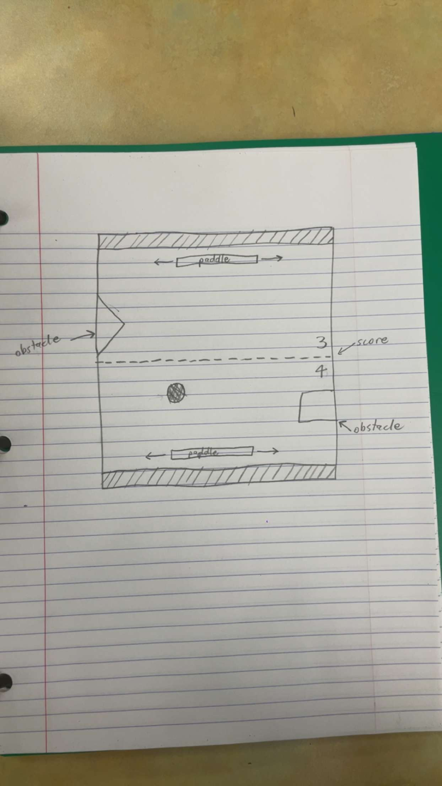

:warning: Everything between << >> needs to be replaced (remove << >> after replacing)

# PING PADDLES
## CS110 Final Project  First Semester, 2023

## Team Members

Aaron Damsky and Joseph Kesler

***

## Project Description

Our program is a game that replicates the classic arcade game, Pong, where two players play against each other hitting a ball back and forth with paddles. The goal is to try and get the ball past the other teams paddle.

***    

## GUI Design

### Initial Design

### Final Design

## Program Design

### Features

1. Home Screen
2. Game Screen (including score)
3. Paddles
4. Ball
5. Obstacles
6. Game Over Screen

### Classes

Ball:
The Ball class creates the ball and takes in three arguments (the x location, the y location, and the radius). This class also has a method that moves the ball across the screen and a reset method that resets the ball to the middle of the screen.

Paddle:
The Paddle class creates a paddle and takes in multiple arguments (the x location, the y location, the color of the paddle, the width of the paddle, and the height of the paddle). The paddle has a move method that moves right when the direction that it takes in is "right" and left when the direction is "left". The Paddle class also has a reset method that resets the paddle to its starting position.

Obstacle:
The Obstacle class creates an obstacle and takes in multiple arguments (the x location, the y location, the width of the obstacle, and the height of the obstacle).

Controller:
The Controller class creates the entire program and puts all of the different classes together so they have a purpose and use. The Controller class has the following methods:
__init__(): Initializes all of the objects and variables used in the program. 
startscreenloop(): Creates the home screen with all of the information on the screen that opens right when the program is ran.
score(): Responsible for displaying the score on the screen.
gameloop(): Creates and organizes everything that is used in the actual game. This includes but is not limited to drawing the game board, accounting for collisions between the ball, paddle, and walls, and changing the score when a goal is scored.
endscreenloop(): Creates the end screen that displays the winner of the game and the final score when one of the teams reaches the maximum score.
mainloop(): Responsible for changing the screens based on what state the program is in.

## ATP

Test Case 1: Paddle Movement

Test Description: Verify that the paddles move left and right as expected.

Test Steps:
Run the program.
Press Space Bar to open the game.
Push the right arrow key.
Verify the blue paddle moves to the right.
Push the left arrow key.
Verify the blue paddle moves to the left.
Push the "d" key.
Verify the red paddle moves to the right.
Push the "a" key.
Verify the red paddle moves to the left.

Expected Outcome: The paddles should move left and right in response to the keyboard key inputs.

Test Case 2: Ball Movement

Test Description: Verify that the ball initially moves correctly on the screen.

Test Steps:
Run the program.
Press Space Bar to open the game.
Press Space Bar to begin the game.
Do not touch the right arrow key, the left arrow key, the "d" key, or the "a" key.
Verify that the ball moves on the screen.

Expected Outcome: When the space bar is initially pressed, the ball should move across the screen depending on how it bounces off of the paddles. 

Test Case 3: Paddle Collisions

Test Description: Verify that the ball bounces off of the paddles.

Test Steps:
Run the program.
Press Space Bar to open the game.
Press Space Bar to begin the game.
Move the first paddle so that the ball bounces off of the paddle.
Verify that the ball bounces off of the paddle.
Move the other paddle so that the ball bounces off of this paddle.
Verify that the ball bounces off of this paddle. 

Expected Outcome: When the space bar is initially pressed, the ball should bounce off of each paddle.

Test Case 4: Wall Collisions

Test Description: Verify that the ball bounces off of the walls as expected. 

Test Steps:
Run the program.
Press Space Bar to open the game.
Press Space Bar to begin the game.
Let the ball bounce off of the first paddle.
Let the ball move across the screen.
Verify that the ball bounces off of both side walls.

Expected Outcome: When the ball hits one of the side walls, it should bounce off the wall at the same angle in the opposite direction.

Test Case 5: Obstacle Collisions

Test Description: Verify that the ball bounces off of the squares appropriately.

Test Steps:
Run the program.
Press Space Bar to open the game.
Press the "1" key.
Verify that the ball bounces off of the top square.
Exit the program.
Rerun the program.
Press Space Bar to begin.
Press the "2" key.
Verify that the ball bounces off of the bottom square.

Expected Outcome: The ball should bounce off of the squares throughout the duration of the game depending on where and at what angle the ball hits the each square.

Test Case 6: Score

Test Description: Ensure all of the appropriate changes occur when a goal is scored.

Test Steps:
Run the program.
Press Space Bar to open the game.
Press Space Bar to begin the game.
Allow the ball to pass one of the paddles.
Verify that opposite player's score increases by one.
Verify that the ball resets to the middle of the screen, like it was at the beginning of the game.
Press Space Bar to resume the game.
Allow the ball to pass the other paddle.
Verify that the opposite player's score increases by one.
Verify that the ball resets to the middle of the screen, like it was at the beginning of the game.

Expected Outcome: When the ball passes a paddle, the opposite player's score increases by one, and the ball resets to the middle of the screen, like it was at the beginning of the game.

Test Case 7: Game Over

Test Description: Confirm that the screen changes to the end screen when one of the players reaches 3 goals.

Test Steps:
Run the program.
Press Space Bar to open the game.
Press Space Bar to begin the game.
Play until one of the players reaches 3 points.
Verify that the end screen pops up stating which player won the game as well as the final score.

Expected Outcome: When one of the players reaches 3 points, the end screen pops up stating which player won the game as well as the final score.
